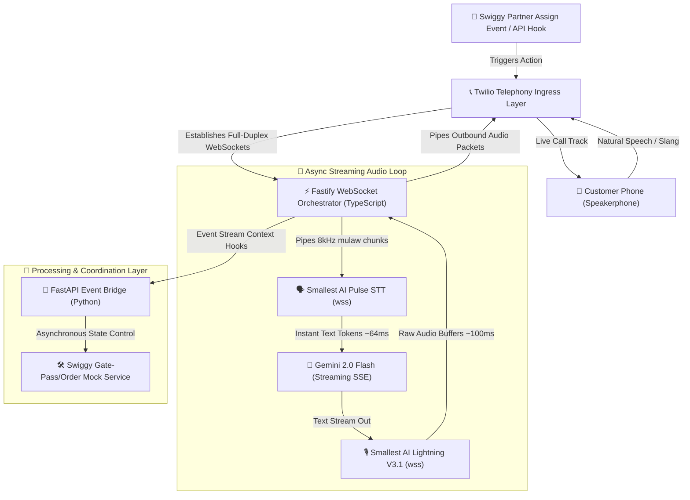

# 🌶️ Late Night Bites -  For the Late night hunger cravings

> ## Ultra-Low Latency Bidirectional Real-Time Streaming AI Delivery Agent
> 
> 
> **Late Night Bites** is a high-performance voice-first orchestration system designed to eliminate high-friction, late-night residential apartment delivery gate-checks. Built on pure WebSockets, it routes full-duplex telephony streams through ultra-low latency speech and cognition layers to resolve food delivery interruptions instantly.

---

## 🏗️ Core Architecture Diagram



---

## 📌 Project Overview

**Late Night Bites** intercepts structural friction inside the conversational commerce ecosystem. Instead of forcing a delivery partner to wait indefinitely at an apartment gate or calling the customer via a laggy, high-latency baseline menu system, this architecture acts as an instant conversational link.

When the system triggers an outbound call, it establishes a live, bi-directional persistent connection. The customer answers, hears a human-like Indic voice with natural local syntax, speaks naturally (blending English and localized terms), and provides the necessary credentials (like gate passes or instruction overrides). The system processes the audio, updates the mock delivery platform state, and guides the delivery partner forward—all wrapped up in a sub-second processing envelope.

---

## 👩‍💼 Real-World Example: Harshitha in a Bangalore PG

> “Harshitha is a software developer living in a strict high-rise PG in HSR Layout, Bangalore. It’s 1:30 AM, she’s exhausted after a long production deployment shift, and she just ordered a cheap midnight meal on Swiggy.
> The delivery partner arrives at the main security gate, but the security guard blocks entry, demanding a MyGate token number or pass validation code before lifting the boom barrier. Rather than forcing the driver to struggle with the app or making Harshitha pick up a tedious standard voice line, **Late Night Bites** instantly fires an automated outbound ring to Harshitha's phone.
> She answers. A natural, friendly Indian voice speaks instantly:
> *'Hey Harshitha! I'm your Swiggy partner at your PG gate right now. Security uncle isn't letting me lift the gate without an entry code. Can you share the pass number?'*
> Harshitha doesn't need to open an application. She just says naturally: *'Oh, entry code is 4-2-9-1. Just tell him that.'*
> On her desk, a live terminal monitor shows the raw binary audio streaming down. Within **~64ms**, `Pulse STT` transcribes her speech, `Gemini 2.0 Flash` extracts the exact intent, and `Lightning V3.1` delivers a voice response back to her ear: *'Got it, 4291! Telling him now and coming up to the third floor.'* >
> The mock gate pass is automatically marked as authorized, the gate clears, and her food is delivered without her ever having to break her workflow.”

---

## 💭 The Problem Space

Engineers building real-time voice products face intense infrastructural constraints:

* **Gateway Timeouts:** Standard REST/HTTP paradigms fail because waiting for an entire sentence to finish before processing creates an immediate 2 to 3-second lag, destroying conversational naturalness.
* **Audio Codec Jitter:** Telephony standards rely on raw **8kHz `mulaw` (PCMU)** streams, whereas modern machine learning systems often assume pristine `linear16` or `PCM` parameters. Conversion overhead can freeze the event loop.
* **The Interruption Problem:** If an AI agent is speaking a long sentence and the human interrupts mid-way, classic batch pipelines cannot break the queue, resulting in overlapping voices.
* **Multi-Language Shifts:** Indian delivery scenarios rely heavily on rapid code-switching (Hinglish/Tenglish blends) that standard models fail to parse at speed.

---

## 🛠️ The Production Tech Stack

| Layer | Technology | Engineering Selection Reason | Free Tier Limits (2026) |
| --- | --- | --- | --- |
| **Orchestration** | **Node.js + Fastify** | High-throughput async routing layer optimized for raw WebSocket connection pooling over standard Express. | `$0` (Local Execution) |
| **Event Bridge** | **Python + FastAPI** | Handles deep data validation pipelines, mock third-party status mapping, and background utility worker scripts. | `$0` (Local Execution) |
| **Ingress/Egress** | **Twilio Media Streams** | Delivers bi-directional full-duplex raw audio chunking inside structural `<Connect><Stream>` parameters. | `$15 Trial Balance` |
| **Perception** | **Smallest AI Pulse STT** | Dedicated low-latency streaming speech node returning rapid live text tokens over WebSockets. | `30 Minutes / Month` (Max 2 concurrent streams) |
| **Cognition** | **Gemini 2.0 Flash** | Server-Sent Events (SSE) text stream engine acting as the low-latency cognitive anchor via the Google AI Studio SDK. | `15 RPM` (Requests Per Minute) |
| **Voice Synthesis** | **Smallest AI Lightning V3.1** | Blazing-fast speech synthesis processing streamed text back into playable audio bytes. | Shared pool in `30 Mins/Mo` allocation |

---

## 📋 Telephony State Machine & Packet Lifecycle

```txt
[Inbound Twilio Stream Frame] ──> Base64 Decode ──> [Raw mulaw Audio Buffer]
                                                             │
                                                     (Piped via WebSockets)
                                                             ▼
                                                [Smallest AI Pulse STT Node]
                                                             │
                                                  (Partial Text Token Emits)
                                                             ▼
                                                [Gemini 2.0 Flash Core Engine]
                                                             │
                                                  (Streaming Text Outputs)
                                                             ▼
                                                [Smallest AI Lightning V3.1]
                                                             │
                                                   (Raw Playback Audio Chunks)
                                                             ▼
[Twilio Audio Track Egress] <── Base64 Encode <── [Output Buffer Construction]

```

---

## 🚀 Key Engineering Learnings Expected

* **Bi-directional WebSocket Orchestration:** Building continuous async connections that process live input/output simultaneously without blocking the single-threaded Node event loop.
* **Telephony Byte Handling:** Mastering real-time data ingestion, processing raw base64 structural payloads, and interacting natively with telephony network configurations.
* **State Interruption Paradigms:** Implementing immediate cache invalidation and sequence clearing logic to instantly halt outbound AI audio frames when incoming user voice metrics are detected.
* **Multi-Runtime Communication:** Building low-overhead transport architectures to bind high-speed TypeScript network interfaces smoothly with async Python processing scripts.

---

## 🎥 Product Demo Video

*(This section will host the live screen-recording showcasing the side-by-side terminal logs, millisecond latency matrices, and real-time physical order delivery execution.)*