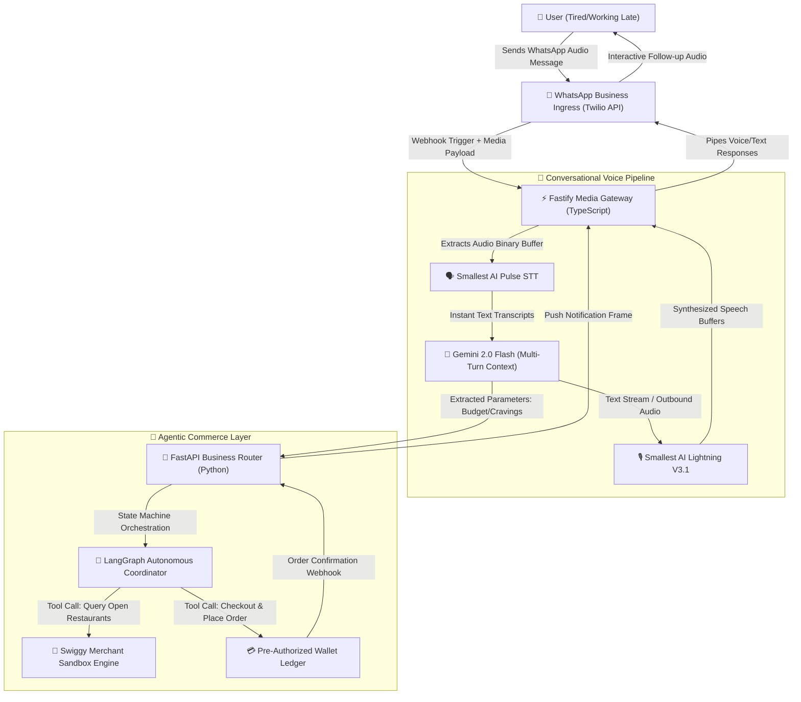

# 🌶️ Late Night Bites - For the Late Night Hunger Cravings

> ## Inbound Voice-Driven Autonomous AI Commerce Agent
> 
> **Late Night Bites** is a high-performance, asynchronous orchestration system designed to turn casual voice inputs into fully executed food orders with zero application UI interaction. Operating via a hybrid TypeScript/Python microservice architecture, it captures incoming audio message payloads from communication apps, runs an autonomous negotiation loop, matches budgets and real-time restaurant performance parameters, and checks out orders entirely in the background.

---

## 🏗️ Core Architecture Diagram



---

## 📌 Project Overview

**Late Night Bites** eliminates structural decision fatigue and application friction when ordering food late at night. Instead of forcing an exhausted user to swipe through user interfaces, evaluate item lists, compare delivery timelines, and process standard payment screens, this architecture reduces the entire transaction to a natural, chat-based audio interface.

The user initiates the process by dropping a single, unstructured audio message. The backend coordinates the audio translation, extracts intent parameters, and boots up an isolated execution worker state machine. The agent actively queries open venues, optimizes the order path against the user's explicit budget constraints, performs the checkout sequence independently, and sends back confirmation, allowing the user to rest uninterrupted until the delivery arrives.

---

## 👩‍💼 Real-World Example: Harshitha in a Bangalore PG

> “Harshitha is a software developer living in a strict high-rise PG in HSR Layout, Bangalore. It’s 1:30 AM, she’s completely exhausted after a brutal production deployment shift, and she is starving. The absolute last thing she has the energy for is opening an app, filtering through 50 open restaurants, looking at items, checking delivery wait-times, and typing in payment details.
> She opens WhatsApp and drops a casual, groggy 4-second voice note:
> *'Bro, I'm super hungry, get me something.'*
> She locks her phone and sets it down. Behind the scenes, **Late Night Bites** catches the media webhook. In **~64ms**, `Pulse STT` transcribes the sound, and `Gemini 2.0 Flash` handles the greeting response. Her phone chiming wakes her as an empathetic audio response returns:
> *'Hey Harshitha! Let's get you fed. What's the budget tonight, and do you want to reorder from your last spot or try something entirely new?'*
> Harshitha sends back a quick follow-up audio clip:
> *'Feel like eating biryani. Any good place under 300 rupees. Fastest delivery, just order it directly.'*
> That is her final interaction. The **Python LangGraph Engine** instantly spins up an autonomous routing routine:
> 1. It pulls her pre-saved PG location coordinates.
> 2. It scans active local merchants, filtering for open biryani hubs under a ₹300 price ceiling.
> 3. It targets the optimal vendor (e.g., *Empire Restaurant* or *Biryani Zone*) based strictly on the shortest delivery time matrix.
> 4. It builds the cart, executes a secure, pre-authorized checkout pipeline, and triggers the active delivery tracking thread.
> 
> 
> Harshitha receives a clean text summary: *'Done! Ordered Chicken Biryani from Empire. Total ₹240. Will be at your door in 22 mins. Go take a nap, I'll alert you when he hits the gate.'*
> She takes a 20-minute nap, completely bypasses application logistics, and wakes up directly to a knock on the door with hot food ready.”

---

## 🛠️ Infrastructure Strategy & Constraints Handling

> ### 💡 Architectural Implementation Disclaimer
> 
> 
> To maximize architectural reliability, decouple external service limits, and adhere to compliance boundaries during development, this system utilizes a professional modular simulation layer for its external endpoints:
> * **The Commerce Layer:** Commercial delivery networks operate within private, closed API networks. To evaluate the agent's real-time decision loops, this system integrates with a stateful Python sandbox environment that mirrors active merchant pricing matrices, dish availabilities, and regional delivery metrics.
> * **The Payment Layer:** Financial regulations and UPI authentication frameworks prevent automated headless debits without physical multi-factor steps. The transactional checkout engine uses a stateful, pre-funded database wallet ledger to validate transaction confirmation, account adjustments, and receipt management.
> * **The Real-World Validation:** For demonstration purposes, the autonomous pipeline runs natively while the user places a low-cost, matching physical order via the retail consumer app interface to verify physical delivery completion.
> 
> 

---

## 💭 The Problem Space

Developers engineering multi-turn voice-first commerce systems encounter several severe design and systemic bottlenecks:

* **Payload Serialization Overheads:** Intercepting unstructured chat media attachments requires handling raw multi-part form data quickly to secure binary components before downstream timeouts kick in.
* **Deterministic Parameter Extraction:** LLMs frequently fail to extract structured boundary conditions (like hard cost limits or strict cuisine parameters) from highly informal, multi-lingual local phrasing without rigorous system prompting.
* **State Machine Consistency:** When an autonomous loop takes over financial checkouts, handling edge cases—such as a specific restaurant closing mid-search or payment tokens expiring—requires state managers that prevent invalid or double orders.
* **Multi-Language Processing:** Late-night consumer requests often rely on rapid code-switching (Hinglish/Telugu-English blends) that must be cleanly mapped to strict API schemas.

---

## 🛠️ The Production Tech Stack

| Layer | Technology | Engineering Selection Reason | Free Tier Limits (2026) |
| --- | --- | --- | --- |
| **Ingress Gate** | **WhatsApp Business API via Twilio** | Serves as the primary user layer, removing custom app build dependencies by moving the UI to a chat window. | `$15 Trial Balance Pool` |
| **Media Router** | **Node.js + Fastify** | High-speed multi-part webhook ingestion layer designed to handle inbound media streams with minimal memory impact. | `$0` (Local Development) |
| **Perception Node** | **Smallest AI Pulse STT** | High-performance transcription system that converts casual voice audio streams into text tokens with deep dialect parsing. | `30 Minutes / Month` (Max 2 concurrent streams) |
| **Cognitive Core** | **Gemini 2.0 Flash** | Selected for rapid context window changes and low token response times via the Google AI Studio SDK. | `15 RPM` (Requests Per Minute) |
| **Execution Loop** | **Python + FastAPI + LangGraph** | Provides structured cyclic tracking, reliable fallback controls, and robust tool integration patterns for multi-step agent actions. | `$0` (Local Development) |
| **Synthesis Node** | **Smallest AI Lightning V3.1** | Transforms generated dynamic responses back into natural, expressive audio packets. | Shared pool in `30 Mins/Mo` allocation |

---

## 📋 Conversational Logic & State Transitions

```txt
[User Input Audio Drop] ──> Webhook Ingestion ──> Audio Buffer Isolation
                                                         │
                                               (Pulse STT Processing)
                                                         ▼
                                             [Extract Intention String]
                                                         │
                                             (Gemini Context Evaluation)
                                                         ▼
                                       { State Evaluation: Missing Values? }
                                         ╱                                ╲
                                       ⎗                                   ⎘
                                 [Yes: Missing Data]               [No: Profile Complete]
                                       │                                   │
                           (Generate Text Stream)                 (Boot Execution Thread)
                                       ▼                                   ▼
                           [Smallest AI Lightning TTS]             [LangGraph Toolkit Node]
                                       │                                   │
                            (Outbound Audio Reply)                (Query/Filter Sandbox)
                                       ▼                                   ▼
                            "What is your budget?"                [Execute Automated Cart]

```

---

## 🚀 Key Engineering Learnings Achieved

* **Unstructured Inbound Stream Extraction:** Building low-latency webhook ingestion architectures that process, convert, and stream multi-part audio file arrays without choking the Node event loop.
* **Stateful Tool-Driven Orchestration:** Implementing complex agent logic via LangGraph in Python to accurately translate casual instructions into deterministic API executions.
* **Context Preservation Across Channels:** Tracking multi-turn conversational data over distinct, stateless HTTP webhook instances using decoupled temporary memory states.
* **Multi-Runtime Data Passing:** Creating clean, decoupled communications between a high-speed JavaScript network edge and a robust Python background processing core.

---

## 🎥 Product Demo Video

*(This section will host the live screen-recording showcasing the side-by-side terminal logs, millisecond latency matrices, real-time autonomous agent reasoning trace, and the physical completion of a cheap test order.)*

```